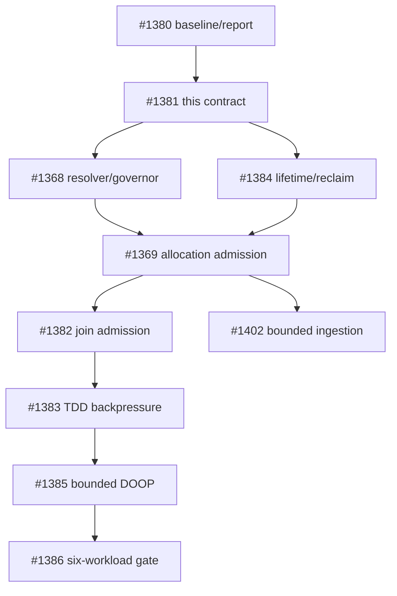

# Memory budget contract

This document defines the memory contract for a managed wirelog session. It
is normative for the resolver, governor, allocation sites, and TDD workers;
it does not turn the current accounting ledger into an allocator or an
admission controller.

## Scope and terminology

The contract covers memory reservations owned by one session: its coordinator,
workers, relation buffers, arenas, arrangements, caches, timestamps, exchange
buffers, and spill state. It does not promise a process-wide or host-wide OOM
guarantee. The following quantities remain distinct:

| Quantity | Meaning | Contract role |
| --- | --- | --- |
| Managed reservation | Bytes admitted to the session governor | Enforced budget |
| Ledger attribution | Best-effort current/peak counters by subsystem | Observability only |
| RSS/working set | Process residency, including allocator retention | Safety signal, not a reservation |
| cgroup/job/address-space limit | An external limit imposed by the host | Input to automatic resolution |
| Physical RAM | Installed or visible machine memory | Never a bounded guarantee by itself |

`wl_mem_ledger_t` currently implements attribution and reporting. Its
`budget == 0` compatibility value means “unlimited ledger accounting”; it
does not mean that a user supplied zero budget is accepted.

## Selecting a budget

There is one environment namespace: `WIRELOG_MEMORY_BUDGET`. The eventual
versioned session-options API has precedence over the environment, and the
environment has precedence over automatic resolution:

```text
versioned API option > WIRELOG_MEMORY_BUDGET > automatic resolution
```

Values are decimal bytes (not MiB or a human-readable suffix). The following
table is part of the interface contract:

| Input | Result |
| --- | --- |
| API option absent and environment unset | Automatic resolution |
| Explicit positive value at least 256 MiB | Enforcing managed budget |
| Explicit zero | Invalid configuration; never silently becomes unlimited |
| Empty, signed, negative, non-decimal, or overflowed value | Invalid configuration |
| Positive value below 256 MiB | Invalid configuration |
| Explicit value on a supported platform | Enforcing managed budget |
| Automatic resolution with no supported limit source | Advisory/unbounded mode, with an explicit diagnostic; no bounded guarantee |

The minimum is a progress floor, not a promise that every workload fits. All
parsing and arithmetic must reject overflow before converting to `uint64_t`.
The internal zero value remains available only to represent an unlimited
ledger in tests and compatibility paths.

For the existing accounting hint, a threshold of `0` means pressure is true
for any valid nonzero subsystem cap, `100` means pressure starts at the cap,
and a value above `100` is invalid and returns false. This is not an admission
decision and does not reject an allocation.

Automatic resolution examines effective limits, not just the first file it can
read:

1. cgroup v2 `memory.max` and `memory.high`, including relevant ancestors;
2. cgroup v1 memory limits, including ancestors and unlimited sentinels;
3. `RLIMIT_AS` where supported, treating it as virtual address-space, not RSS;
4. supported Windows Job Object process-memory limits;
5. no physical-RAM-only fallback for an enforcing guarantee.

An unlimited cgroup value, an absent optional source, and an unsupported
platform are different observations. The resolver records which source was
selected and whether the result is enforcing or advisory. Tests use injected
provider fixtures for these cases; they must not depend on the host's actual
cgroup or RAM configuration.

## Reservation lifecycle

Every managed allocation follows this transaction:

```text
reserve(bytes) -> commit/transfer(owner) -> release(bytes)
       |                 |
       +-- rollback/cancel on failure
```

- `reserve` is an atomic admission operation against the shared session
  budget. It happens before the allocation can become visible to another
  operation.
- `commit` attaches the reservation to its owner. A transfer between the
  coordinator and a worker changes attribution, not the shared limit.
- `release` is idempotent for a committed reservation and returns capacity.
- Failed allocations roll back their reservation. Cancellation releases
  reservations and must not publish a partial result.
- A realloc that needs both old and new storage reserves the new size while
  the old size is still counted; only after a successful move may it release
  the old reservation.
- Overflow in a size, sum, or headroom calculation is a distinct
  representation-overflow failure, never a wrapped small reservation.
- A reserved cleanup/drain headroom remains available for rollback, error
  reporting, and worker teardown. It is not handed out as ordinary work
  capacity.

Coordinator and worker operations use one shared governor. A worker share is
only a fairness hint used for scheduling; `W` workers do not receive `W`
independent hard budgets. RSS sampling, allocator retention, and sampling
lag may trigger a safety brake, but they do not rewrite committed ownership.

## Failure and retry contract

These outcomes remain distinguishable internally and at the public boundary:

| Outcome | Meaning | Retry/reset rule |
| --- | --- | --- |
| Budget denial | Reservation would consume available managed capacity | Reclaim, reduce work, spill, or report a bounded-memory failure |
| Allocator failure | `malloc`/system allocation returned failure | Release reservation; report memory failure |
| Representation overflow | Size arithmetic cannot be represented | Release reservation; report invalid/overflow failure |
| I/O/spill failure | External backing store failed | Release or retain only durable committed state; report I/O failure |
| Cancellation | Host or operation cancellation | Roll back unpublished work and reservations |
| Unsupported configuration | Requested enforcement source/platform is unavailable | Explicit request fails; automatic mode may remain advisory as above |

On a successful retry after reclaim or a smaller request, the operation's
error state is reset and no partial rows are published. Retry loops are
bounded; the governor must not spin indefinitely while RSS or capacity is
unchanged. Public `create`, `insert`, `step`, and `snapshot` paths, including
typed and easy facades, must map these outcomes consistently when enforcement
is implemented.

## Ownership and sequencing

This issue defines the contract and boundary fixtures. Implementation is
owned as follows:

| Work | Owner | This contract supplies |
| --- | --- | --- |
| Budget source resolution, shared governor, advisory/enforcing state | #1368 | Precedence, providers, minimum, headroom, source provenance |
| Allocation-site admission and public propagation | #1369 | Reservation lifecycle, error taxonomy, retry/reset boundaries |
| Arrangement/cache lifetime and reclaim primitives | #1384 | Release/transfer behavior and cleanup reserve |
| Join admission, ingestion, TDD backpressure | #1382, #1402, #1383 | Workload-specific reservation sizes and rollback tests |
| Bounded DOOP and downstream gates | #1385–#1387 | Evidence that the contract works under constrained memory |

The existing ledger tests prove accounting invariants only: they do not prove
admission, allocator ownership, RSS control, or OOM prevention. In
particular, `wl_mem_ledger_alloc()` remains a post-allocation accounting call
and must not be used as a substitute for `reserve()`.



## Acceptance evidence

The contract unit is complete only when documentation and executable ledger
fixtures agree on:

- exact percentage arithmetic at `UINT64_MAX` scale;
- zero/unlimited internal ledger behavior and clamped remaining capacity;
- threshold `0`, `100`, and invalid values above `100`;
- saturating accounting rather than counter wraparound;
- deterministic subsystem percentages summing to 100;
- the boundary between accounting evidence and future admission evidence.

Resolver-provider, reservation-lifecycle, public-error, and allocation-site
tests belong to #1368/#1369 and must be added there with their unimplemented
symbols; this document does not claim those behaviors already exist.
